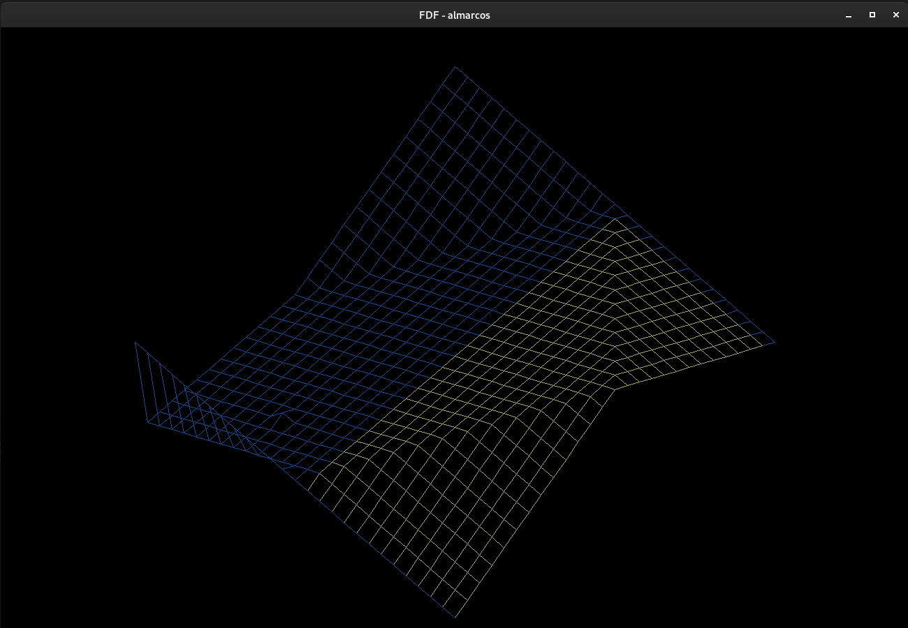
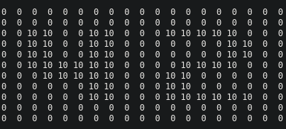
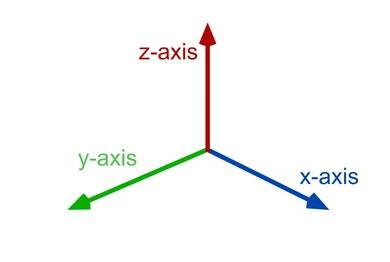
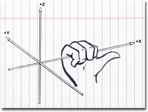
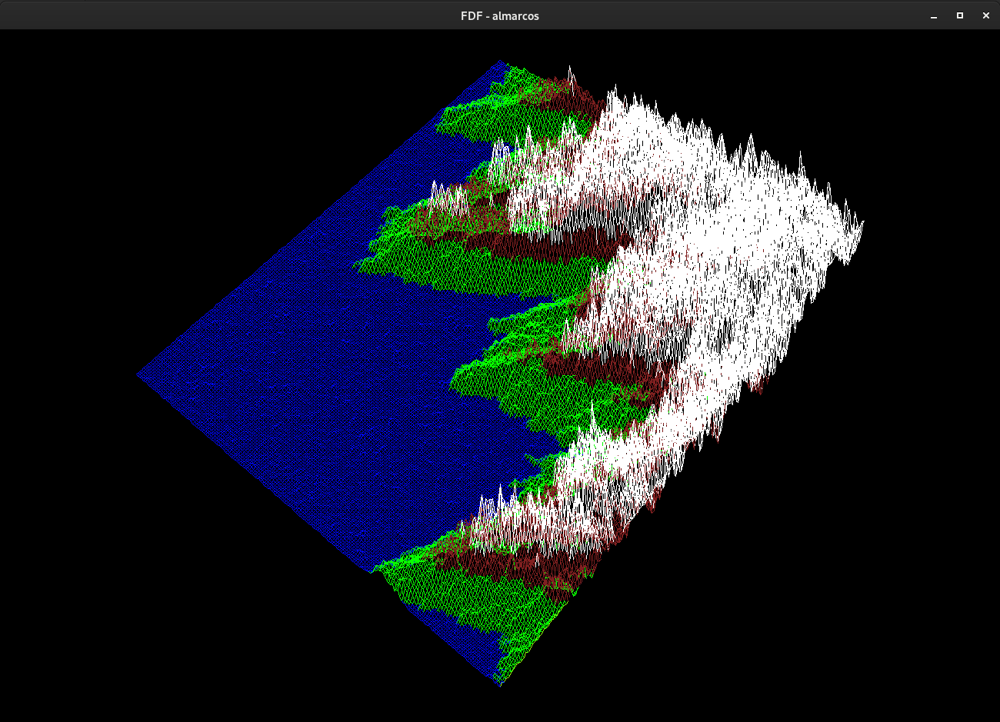
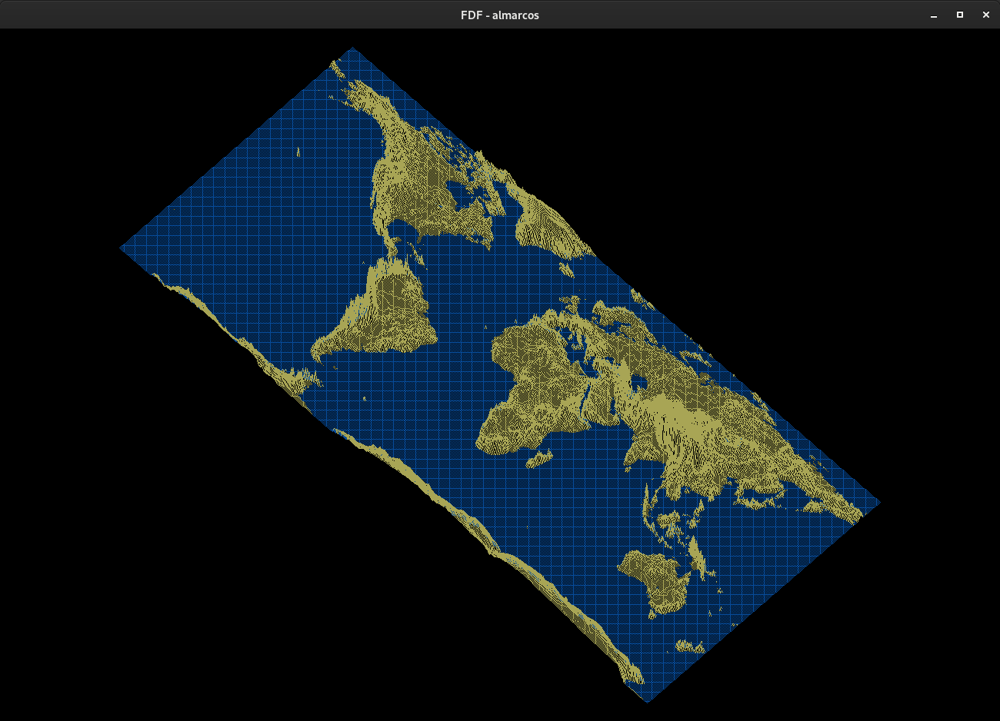
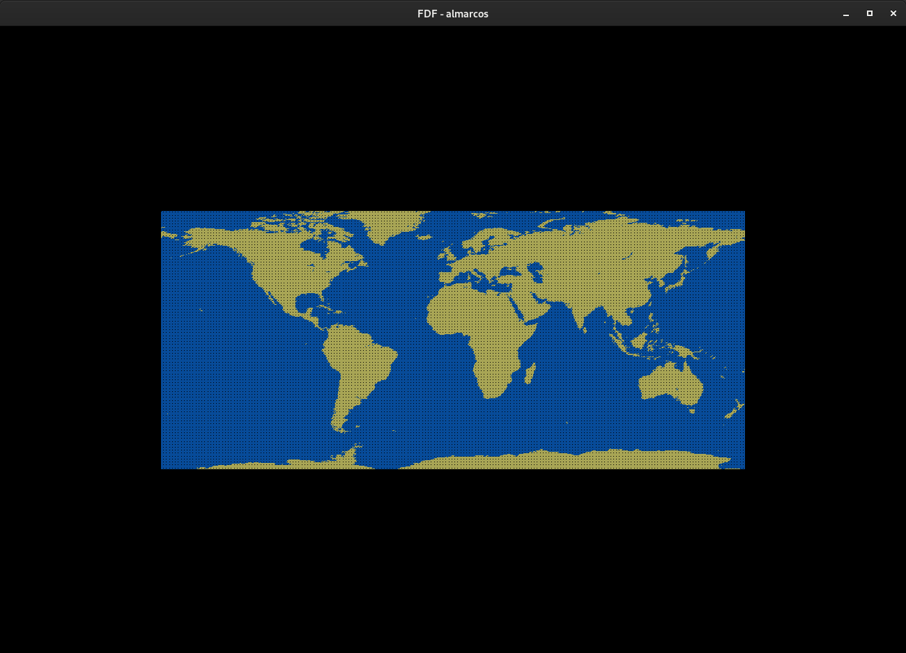

# FDF
  
FDF is a program that read a map and render it in 3D. The map give us several points and we have to link these points with lines to form the projection. FDF is short for "Fil de Fer" in French that means ’wireframe model’, that is, all surfaces of the 3D object are outlined by lines.

## How to use
In order to compile and run, follow these steps. You must have glfw (Graphics Library Framework) and cmake instaled. 

```shell
git clone https://github.com/alissonmarcs/fdf.git
cd fdf
make bonus
./fdf_bonus ./maps/elem2.fdf
```

Compiling with `make bonus` you will be able to use keys to rotate, translate and zoom than only with `make`. These are keys for doing that:
- Arrow keys to translate.
- Equal and minus keys to zoom.
- `w` and `s` to rotate aroud x axes.
- `a` and `d` to rotate around y axes.
- `q` and `e` to rotate around z axes.
- `j` and `k` to increase/decrease z scale.
- `r` to reset view.
- `1` and `2` to toggle beetween isometric and top view projection.
- `Esc` to close windows and terminate.

Several maps are avaliable in `maps` folder. More cool maps are avaliable in `maps/others` folder.

## Key concepts to develop the project

- Understanding the map file format.
- How to get isometric projection (3D projection that subject requires).
- Understanding rotations.
- Drawing lines that connect every point on the map.

### Understanding the map file format

  
maps/42.fdf

The map file give us several numbers, every number represent a point. Every point in map have yours x, y and z cordinate. The x value of a point is the column index that he is (the line is splited by spaces), the y value of a point is the line index that he is, and the z value is its not any index, but the value itself. Every number we see in the above map file are values for z of all points, while the x and y values are infered by the position of the z values. 

### How to get isometric projection

See the projection axes as the follows:



To get isometric, all we have to do is rotate projection aroud it vertical axis z by 45° then rotate again around x axis by 35°.

### Understanding rotations

Rotate a projection around its whateaver axis is like we grab that axis with our handy and twist it.



The traditional way of doing that is using rotation matrices, but I used simplified formulas for doing that.

### Drawing lines that connect every point  on the map

To form the desired projection we have to connect all the points that map give us. Since [MLX42](https://github.com/codam-coding-college/MLX42) graphics library doest have function to draw lines, I have do study Bresenham line drawing algorithm and implement it.

## Screenshots

  
/maps/elem2.fdf

  
/maps/t1.fdf

  
maps/others/MGDS_WHOLE_WORLD_OCEAN0_L.fdf

  
./maps/others/MGDS_WHOLE_WORLD_OCEAN0_L.fdf in top view projection.
