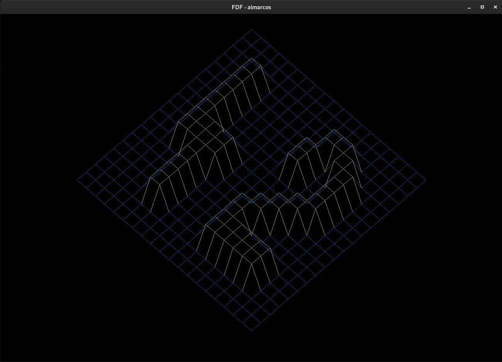

# FDF
  
FDF is a program that read a map and render it in 3D. The map give us several points and I have to link these points with lines. FDF is short for "Fil de Fer" in French that means ’wireframe model’, that is, all surfaces of the 3D object are outlined by lines.

## How to use
In order to compile, you must have glfw (Graphics Library Framework) and cmake instaled. 

```shell
git clone https://github.com/alissonmarcs/fdf.git
cd fdf
make bonus
./fdf_bonus ./maps/elem2.fdf
```

With `make bonus` you are able to use keys to rotate, translate and zoom than only with `make`:
- Arrow keys to translate.
- Equal and minus keys to zoom.
- `w` and `s` to rotate aroud x axes.
- `a` and `d` to rotate around y axes.
- `q` and `e` to rotate around z axes.
- `j` and `k` to increase/decrease z scale.
- `r` to reset view.
- `1` and `2` to toggle beetween isometric and top view projection.
- `Esc` to close windows and terminate.

Several cool maps are avaliable in maps folder. More cool maps are avaliable in maps/others folder.

## Screenshots

  
/maps/elem2.fdf

  
/maps/t1.fdf

  
maps/others/MGDS_WHOLE_WORLD_OCEAN0_L.fdf

  
./maps/others/MGDS_WHOLE_WORLD_OCEAN0_L.fdf in top view projection.
